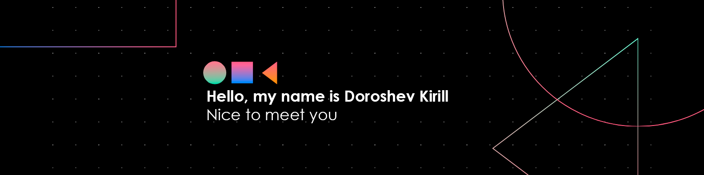

    
    

    I am a second year student at the Siberian Federal University majoring in Software Engineering 💻. At the same time, I am studying at the Yandex workshop in the direction of FullStack programmer 📚. I have experience developing applications based on C++/C#/Python. But I really want to develop in the web technology industry with a development vector for the backend part 🌐.

    <h2 align="center">Independent skills from the IT direction  </h2>
    

        
        
    

    <h2 align="center">Technology web-stack  </h2>
    <h3 align="center">General</h3>
    

        
        
        
    

    <h3 align="center">Collectors</h3>
    
 
         
    

    <h3 align="center">Linter and formatters</h3>
    

        
        
    

    <h3 align="center">Postprocessing</h3>
    
 
        <a href="https://www.npmjs.com/package/html-minifier" target="_blank">HTMLMinifier</a>
         
    

    <h3 align="center">template engine</h3>
    
 
         
    

    <h3 align="center">Web Design Tools</h3>
    

        
    

    <h3 align="center">The layout method</h3>
    

        
    

<h2 aria-hidden="true" align="center" style="margin=0; paddong=0"> My GitHub Stats </h2>

    
    
     
     
    

     
     
     

