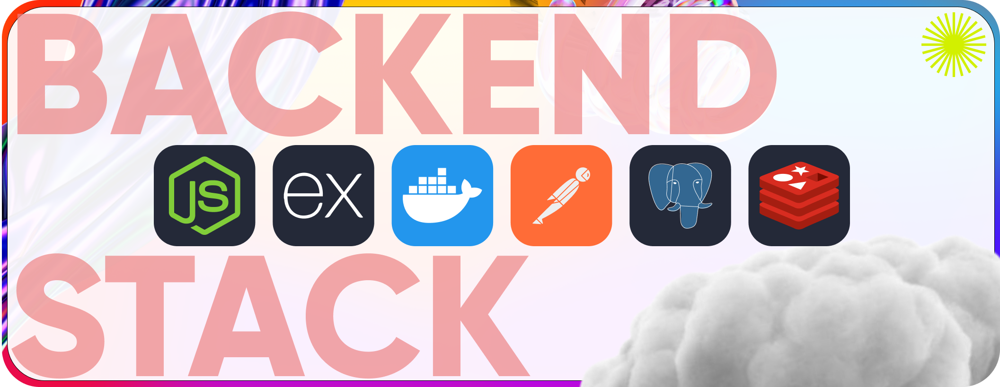
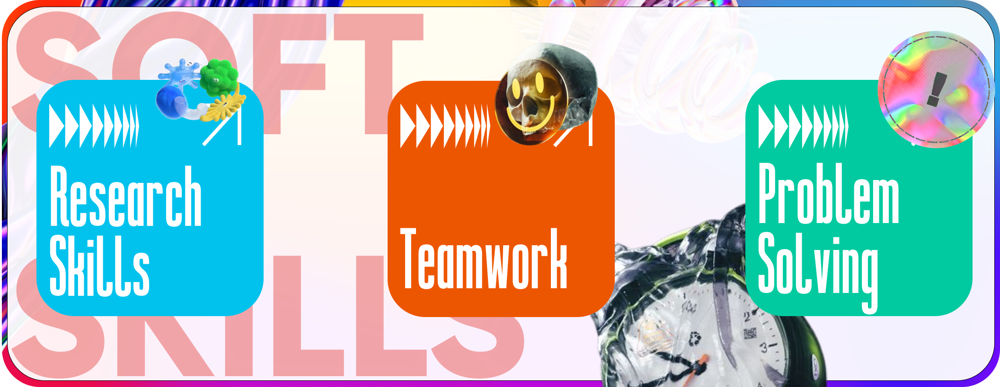

  
  

<!--
⠀ ⠀⠀⠀⠀⠀⠀⠀⠀⠀⠀⠀⠀⠀⠀⠀⠀⠀⠀⠀⠀⠀⠀⠀⠀⠀⠀⠀⠀⠀⠀⠀⠀⣀⣀⣀⣀⣀⠀⠀⠀⠀⠀⠀⠀⠀⠀⠀⠀
⠀⠀⠀⠀⠀⠀⠀⠀⠀⠀⠀⠀⠀⠀⠀⠀⠀⠀⠀⠀⠀⠀⠀⠀⠀⠀⠀⠀⠀⠀⠀⠀⢀⣾⠋⠉⠉⠉⠙⠛⠻⢶⣤⡀⠀⠀⠀⠀⠀⠀
⠀⠀⠀⠀⠀⠀⠀⠀⠀⠀⠀⠀⠀⠀⠀⠀⠀⠀⠀⠀⠀⠀⠀⠀⠀⠀⠀⠀⠀⠀⠀⣠⡾⠁⠀⠀⠀⠀⠀⠀⠀⠀⠈⢻⡆⠀⠀⠀⠀⠀
⠀⠀⠀⠀⠀⠀⠀⠀⠀⠀⠀⠀⠀⠀⠀⠀⠀⠀⠀⠀⠀⠀⠀⠀⠀⠀⢀⣀⣀⣠⣴⠟⠀⠀⠀⠀⠀⠀⠀⠀⠀⠀⣠⡟⠁⠀⠀⠀⠀⠀
⠀⠀⠀⠀⠀⠀⠀⠀⠀⠀⠀⠀⠀⠀⠀⠀⠀⠀⠀⠀⠀⢀⣠⣴⠶⠟⠛⠉⠉⠁⠀⠀⠀⠀⠀⠀⠀⠀⠀⠀⠀⢰⡟⠀⠀⠀⠀⠀⠀⠀
⠀⠀⠀⠀⠀⠀⠀⠀⠀⠀⠀⠀⠀⠀⠀⠀⠀⣀⣠⣴⠾⠛⠉⠀⠀⠀⠀⠀⠀⠀⠀⠀⠀⠀⠀⠀⠀⠀⠀⠀⢀⣾⠁⠀⠀⠀⠀⠀⠀⠀
⠀⠀⠀⠀⠀⠀⠀⠀⠀⠀⠀⠀⠀⣠⡶⠛⠛⠋⠉⠀⠀⠀⠀⠀⠀⠀⠀⠀⠀⠀⠀⠀⠀⠀⠀⠀⠀⠀⠀⣴⠟⠁⠀⠀⠀⠀⠀⠀⠀⠀
⠀⠀⠀⠀⠀⠀⠀⠀⠀⠀⠀⠀⣰⡟⠀⠀⠀⠀⠀⠀⠀⠀⠀⠀⠀⠀⠀⠀⠀⠀⠀⠀⠀⠀⠀⠀⠀⢀⣾⠋⠀⠀⠀⠀⠀⠀⠀⠀⠀⠀
⠀⠀⠀⠀⠀⠀⠀⠀⠀⠀⣴⠞⠋⠀⠀⠀⠀⣠⣴⠶⠶⣦⡀⠀⠀⠀⠀⠀⠀⠀⠀⠀⠀⠀⠀⠀⣠⡿⠁⠀⠀⠀⠀⠀⠀⠀⠀⠀⠀⠀
⠀⠀⠀⠀⠀⠀⠀⠀⠀⠀⢿⣄⣀⣀⣤⡴⠟⠋⠀⠀⠀⠘⣷⡀⠀⠀⠀⠀⠀⠀⠀⠀⠀⠀⠀⣰⠟⠀⠀⠀⠀⠀⠀⠀⠀⠀⠀⠀⠀⠀
⠀⠀⠀⠀⠀⠀⠀⠀⠀⠀⢰⣟⠉⠙⢷⣄⠀⠀⠀⠀⠀⠀⠘⣷⠀⠀⠀⠀⠀⠀⠀⠀⠀⠀⣼⠏⠀⠀⠀⠀⠀⠀⠀⠀⠀⠀⠀⠀⠀⠀
⠀⠀⠀⠀⠀⠀⠀⠀⠀⠀⠀⠙⣷⡀⠀⠹⣧⡀⠀⠀⠀⠀⠀⣼⠃⠀⠀⠀⠀⠀⠀⠀⢀⣾⠃⠀⠀⠀⠀⠀⠀⠀⠀⠀⠀⠀⠀⠀⠀⠀
⠀⠀⠀⠀⠀⠀⠀⠀⠀⠀⠀⠀⠘⣷⡀⠀⠈⠛⣷⣤⣴⠶⠟⠃⠀⠀⠀⠀⠀⠀⠀⢀⣾⠃⠀⠀⠀⠀⠀⠀⠀⠀⠀⠀⠀⠀⠀⠀⠀⠀
⠀⠀⠀⠀⠀⠀⠀⠀⠀⠀⠀⠀⠀⠘⣷⡀⠀⠀⠈⠀⠀⠀⠀⠀⠀⠀⠀⠀⠀⠀⢀⣾⠃⠀⠀⠀⠀⠀⠀⠀⠀⠀⠀⠀⠀⠀⠀⠀⠀⠀
⠀⠀⠀⠀⠀⠀⠀⠀⠀⠀⠀⠀⠀⠀⠈⢷⣄⠀⠀⠀⠀⠀⠀⠀⠀⠀⠀⠀⠀⠀⢸⡇⠀⠀⠀⠀⠀⠀⠀⠀⠀⠀⠀⠀⠀⠀⠀⠀⠀⠀
⠀⠀⠀⠀⠀⠀⠀⠀⠀⠀⠀⠀⠀⠀⠀⠀⠙⠻⠟⠛⣻⡿⠀⠀⠀⠀⠀⢀⣤⡾⠛⠀⠀⠀⠀⠀⠀⠀⠀⠀⠀⠀⠀⠀⠀⠀⠀⠀⠀⠀
⠀⠀⠀⠀⠀⠀⠀⠀⠀⠀⠀⠀⠀⠀⠀⠀⠀⠀⣠⡾⠋⠀⠀⠀⠀⢀⣴⠟⣿⠀⠀⠀⠀⠀⠀⠀⠀⠀⠀⠀⠀⠀⠀⠀⠀⠀⠀⠀⠀⠀
⠀⠀⠀⠀⠀⠀⠀⠀⠀⠀⠀⠀⠀⠀⠀⠀⠀⣴⠟⠀⠀⠀⠀⣠⣾⡿⠁⢀⣿⠀⠀⠀⠀⠀⠀⠀⠀⠀⠀⠀⠀⠀⠀⠀⠀⠀⠀⠀⠀⠀
⠀⠀⠀⠀⠀⠀⠀⠀⠀⠀⠀⠀⠀⠀⠀⠀⣼⠏⠀⠀⠀⢀⡾⢫⣿⠁⠀⣼⠇⠀⠀⠀⠀⠀⠀⠀⠀⠀⠀⠀⠀⠀⠀⠀⠀⠀⠀⠀⠀⠀
⠀⠀⠀⠀⠀⠀⠀⠀⠀⠀⠀⠀⠀⠀⢀⡾⠃⠀⠀⢀⣴⠟⢡⡟⣿⠀⠀⣿⠀⠀⠀⠀⠀⠀⠀⠀⠀⠀⠀⠀⠀⠀⠀⠀⠀⠀⠀⠀⠀⠀
⠀⠀⠀⠀⠀⠀⠀⠀⠀⠀⠀⠀⠀⣰⠟⠁⠀⠀⣰⠟⠁⢠⡿⠀⢿⡄⢰⡟⠀⠀⠀⠀⠀⠀⠀⠀⠀⠀⠀⠀⠀⠀⠀⠀⠀⠀⠀⠀⠀⠀
⠀⠀⠀⠀⠀⠀⠀⠀⠀⠀⠀⠀⣼⠏⠀⠀⢠⣾⠋⠀⢀⡿⠁⠀⠈⠛⠿⠃⠀⠀⠀⠀⠀⠀⠀⠀⠀⠀⠀⠀⠀⠀⠀⠀⠀⠀⠀⠀⠀⠀
⠀⠀⠀⠀⠀⠀⠀⠀⠀⠀⠀⢸⡏⠀⠀⣴⢿⡟⠀⠀⣾⠃⠀⠀⠀⠀⠀⠀⠀⠀⠀⠀⠀⠀⠀⠀⠀⠀⠀⠀⠀⠀⠀⠀⠀⠀⠀⠀⠀⠀
⠀⠀⠀⠀⠀⠀⠀⠀⠀⠀⠀⠈⢷⣄⣾⠋⠘⣧⡀⢰⡟⠀⠀⠀⠀⠀⠀⠀⠀⠀⠀⠀⠀⠀⠀⠀⠀⠀⠀⠀⠀⠀⠀⠀⠀⠀⠀⠀⠀⠀
⠀⠀⠀⠀⠀⠀⠀⠀⠀⠀⠀⠀⠀⠉⠁⠀⠀⠈⠛⠋⠀⠀⠀⠀⠀⠀⠀-->

<!--   -->

<!-- 
 -->
<!--     <h2 align="center">Frontend-stack main </h2> -->
<!--     
 -->
<!--          -->
<!--       <picture> -->
<!--           <source srcset="soft-skills.png" media="(prefers-color-scheme: dark)"> -->
<!--           <source srcset="frontend-stack-dark.png" media="(prefers-color-scheme: light)">
          
        </picture> -->
<!--     
 -->
<!--     <h6 align="center">Sub-Main frontend skills</h6>
    

        
        
        
        
        
        
        
    
 -->
<!--     <h2 align="center">Backand-stack main </h2> -->
<!--     
 -->
<!--          -->
<!--       <picture> -->
<!--           <source srcset="soft-skills.png" media="(prefers-color-scheme: dark)"> -->
<!--           <source srcset="backend-stack-dark.png" media="(prefers-color-scheme: light)">
          
        </picture> -->
<!--     
 -->
<!--     <h2 align="center">Other skills  </h2> -->
<!--     
 -->
<!--          -->
<!--       kafka -->
<!--     
 -->
<!--     <h2 align="center"> </h2> -->
<!--       
 -->
<!--          -->
<!--         <picture> -->
<!--           <source srcset="soft-skills.png" media="(prefers-color-scheme: dark)"> -->
<!--           <source srcset="soft-skills-dark.png" media="(prefers-color-scheme: light)"> -->
<!--            -->
<!--         </picture> -->
<!--       
 -->
<!-- 
 -->

<!-- <h2 aria-hidden="true" align="center" style="margin=0; paddong=0"> My GitHub Stats </h2> -->

<!-- 
 -->
<!--     
 -->
<!--        -->
<!--        -->
<!--        -->
<!--        -->
<!--        -->
<!--        -->
<!--     
 -->
<!-- 
 -->

